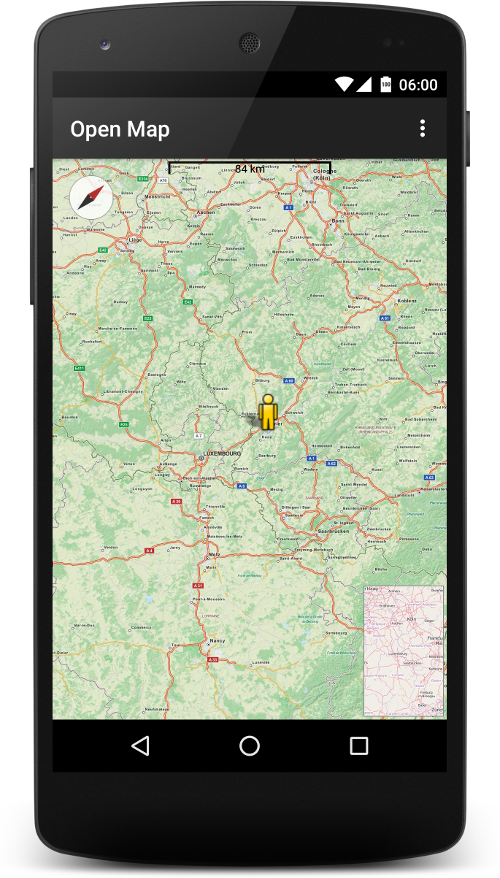
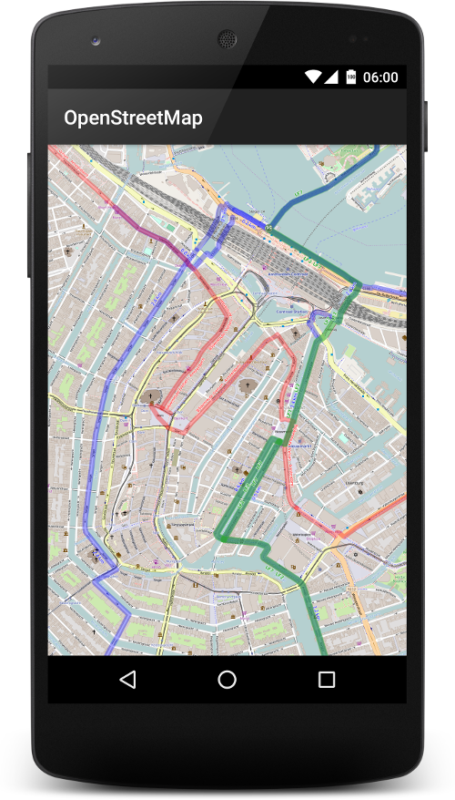
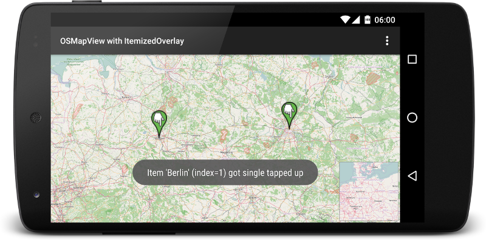

# osmdroid [](https://travis-ci.org/osmdroid/osmdroid) [](https://maven-badges.herokuapp.com/maven-central/org.osmdroid/osmdroid-android) [](https://android-arsenal.com/details/1/279) [](https://sourcespy.com/github/osmdroidosmdroid/)

osmdroid is a (almost) full/free replacement for Android's MapView (v1 API) class. It also includes a modular tile provider system with support for numerous online and offline tile sources and overlay support with built-in overlays for plotting icons, tracking location, and drawing shapes.

<a href="https://f-droid.org/packages/org.osmdroid/">
</a>
<a href="https://play.google.com/store/apps/details?id=org.osmdroid">
</a>

Current Release: **6.1.13 May 14, 2022**

Current Development version: 6.1.14-SNAPSHOT

Next Release Version (planned): 6.1.14

Note: check your calendar, it may take up to a few days for all global mirrors to update.

Please read the [osmdroid wiki](https://github.com/osmdroid/osmdroid/wiki) for  tutorials on integration.

**Gradle dependency**
```groovy
repositories {
        mavenCentral()
}

dependencies {
    compile 'org.osmdroid:osmdroid-android:<VERSION>'
}
```

Be sure to replace `<VERSION>` with the last release version above.


**Maven dependency**
```xml
<dependency>
  <groupId>org.osmdroid</groupId>
  <artifactId>osmdroid-android</artifactId>
  <version><VERSION></version>
  <type>aar</type>
</dependency>
```

**Platform or API Level (API level 8 = Platform 2.2)**

Note: this just assumes you need just osmdroid-android. Other modules require higher min SDK levels.

```xml
<platform>8</platform>
```
You can also [compile osmdroid from source](https://github.com/osmdroid/osmdroid/wiki/How-to-build-osmdroid-from-source) or [download the dependency directly from OSS](https://oss.sonatype.org/content/groups/public/org/osmdroid/osmdroid-android/) or [download the distribution package](https://github.com/osmdroid/osmdroid/releases)

## Want the latest and greatest?

We periodically publish snapshots to maven central. 
If you're interesting in trying it out, using the following:

```groovy
repositories {
    mavenCentral()
    maven{
        url  'https://oss.sonatype.org/content/repositories/snapshots/'
        name 'OSS-Sonatype'
    }
}
dependencies {
    compile 'org.osmdroid:osmdroid-android:<VERSION>-SNAPSHOT:debug@aar'
}
```

Use at your own risk though, it may not be stable or may have bugs or performance issues.
If you run across any, please report them.

In case gradle doesn't resolve it, it can be download manually here:
https://oss.sonatype.org/service/local/repositories/snapshots/content/org/osmdroid/osmdroid-android/<VERSION>-SNAPSHOT/osmdroid-android-<VERSION>-SNAPSHOT.aar

Side note: gradle's cached dependencies and doesn't really handle snapshot very well.
To force gradle to update snapshots on every build, try adding this to your root `build.gradle` file.

```groovy
allprojects  {
  // forces all changing dependencies (i.e. SNAPSHOTs) to automagicially download
    configurations.all {
        resolutionStrategy {
            cacheChangingModulesFor 0, 'seconds'
    }
}
```

You can also build your project using the gradle option `--refreshDependencies`

## OK now what?

Continue reading here, [How-to-use-the-osmdroid-library](https://github.com/osmdroid/osmdroid/wiki)

Related and **important** wiki articles
 * [Change Log](https://github.com/osmdroid/osmdroid/wiki/Changelog)
 * [FAQ](https://github.com/osmdroid/osmdroid/wiki/FAQ)
 * [Important notes on using osmdroid in your app](https://github.com/osmdroid/osmdroid/wiki/Important-notes-on-using-osmdroid-in-your-app)
 * [Upgrade guide](https://github.com/osmdroid/osmdroid/wiki/Upgrade-Guide)

## I have a question or want to report a bug

If you have a question, please view the [osmdroid FAQ](https://github.com/osmdroid/osmdroid/wiki/FAQ).  
You can also view the [Stack Overflow osmdroid tag](http://stackoverflow.com/questions/tagged/osmdroid) and [osmdroid Google Group](https://groups.google.com/forum/#!forum/osmdroid) where you can get feedback from a large pool of osmdroid users.

If you still have an issue, please check the [Changelog](https://github.com/osmdroid/osmdroid/wiki/Changelog) page to see if this issue is fixed in a newer or upcoming version of osmdroid.

If think you have a legitimate bug to report then go to the [Issues](https://github.com/osmdroid/osmdroid/issues?state=open) page to see if your issue has been reported. If your issue already exists then please contribute information that will help us track down the source of the issue. If your issue does not exist then create a new issue report. When creating an issue, please include the version of osmdroid, the Android platform target and test device you are using, and a detailed description of the problem with relevant code. It is particularly helpful if you can reproduce the problem using our [OpenStreetMapViewer](https://github.com/osmdroid/osmdroid/tree/master/OpenStreetMapViewer) sample project as your starting point.

## I want to contribute

See our [contributing guide](https://github.com/osmdroid/osmdroid/blob/master/CONTRIBUTING.md) 

For your reference, the [dashboard](https://sourcespy.com/github/osmdroidosmdroid/) provides a high level overview of the repository including structure of [UI classes](https://sourcespy.com/github/osmdroidosmdroid/xx-ouiswing-.html), [module dependencies](https://sourcespy.com/github/osmdroidosmdroid/xx-omodulesc-.html), [external libraries](https://sourcespy.com/github/osmdroidosmdroid/xx-ojavalibs-.html), and other components of the system.

## I want more!

The [OSMBonusPack project](https://github.com/MKergall/osmbonuspack) adds additional functionality for use with osmdroid projects.

## Screenshots





## Demo Videos

[Free Draw](https://youtu.be/b119xU1UCXs)

[Maps Forge](https://youtu.be/xXCr_bLebMk)

[Floating point zoom](https://youtu.be/YBjjjLPuFdM)

[IIS Tracker](https://youtu.be/Jw8z1ke9Idk)

## Building from source for editing osmdroid 

JDK11+ is required
Gradle 7.4.2 is what we are currently using
Android Studio Bumblebee
(latest supported configuration as of May 2022)

```
./gradlew clean build
```

Then you can install and test the app using normal command line utils.

Or just open Android studio.

## Building from source and using the aar's in your app

JDK11+ is required
Gradle 7.4.2 is what we are currently using
(latest supported configuration as of May 2022)

We recommend building from the command line.


```
./gradlew clean build publishToMavenLocal
```

In **your** root `build.gradle` file, add mavenLocal() if not present.
```
allprojects {
    repositories {
            mavenCentral()
            mavenLocal()    //add this if it's missing
    }
}

```

Then in your APK or AAR project that needs osmdroid.

```
    compile 'org.osmdroid:osmdroid-android:<VERSION>-SNAPSHOT:debug@aar'
```
Where VERSION is the version listed as the value for `pom.version` in osmdroid's `gradle.properties`. Note that when using the release versions from Maven Central, drop the `:debug@aar` part. When using a "release" version that you build locally with gradle, you'll need `:debug@aar` instead.

